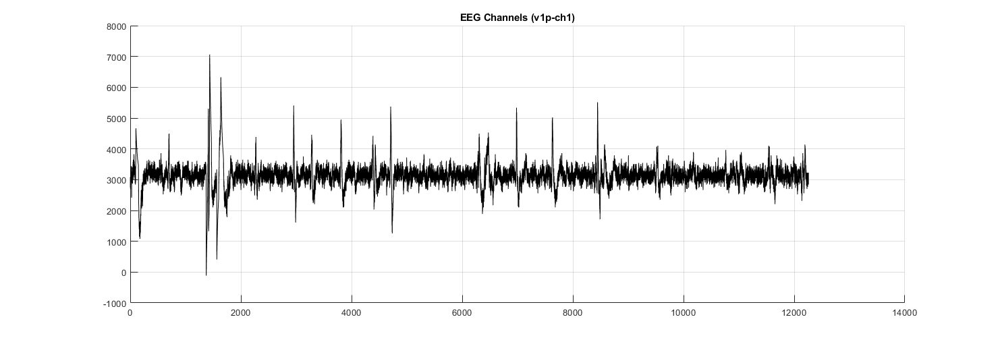

# Dataset: IEEE ADHD-control-children

[Download](https://ieee-dataport.org/open-access/eeg-data-adhd-control-children)

> Since one of the deficits in ADHD children is visual attention, the EEG recording protocol was based on visual attention tasks. In the task, a set of pictures of cartoon characters was shown to the children and they were asked to count the characters. The number of characters in each image was randomly selected between 5 and 16, and the size of the pictures was large enough to be easily visible and countable by children. To have a continuous stimulus during the signal recording, each image was displayed immediately and uninterrupted after the child’s response. Thus, the duration of EEG recording throughout this cognitive visual task was dependent on the child’s performance (i.e. response speed).

## Data Shape

- **Samples:** 61 ADHD, 60 Control  
- **Sequence Length:** 7,938 ~ 43,252  
- **Channels:** 19  

## Preprocessing

- Segmented into fixed-length subsets of **2,560** (20ms at 128Hz)  
  - [preprocess.ipynb](./preprocess.ipynb) for details  
- Split into **train, validation, and test** sets:  
  - **Train:** 70% → Shape: `[547, 19, 2560]`  
  - **Validation:** 10% → Shape: `[77, 19, 2560]`  
  - **Test:** 20% → Shape: `[159, 19, 2560]`  
  - [split.ipynb](./split.ipynb) for implementation  
- Additional metadata available in [metadata.json](/assets/IEEE/metadata.json)  

